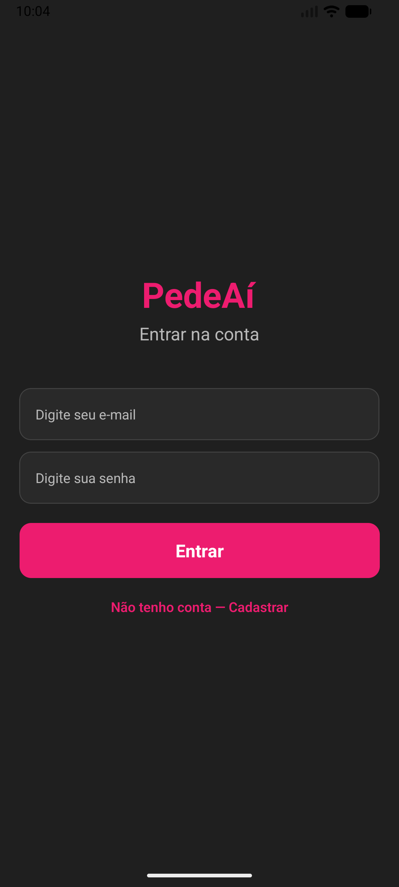
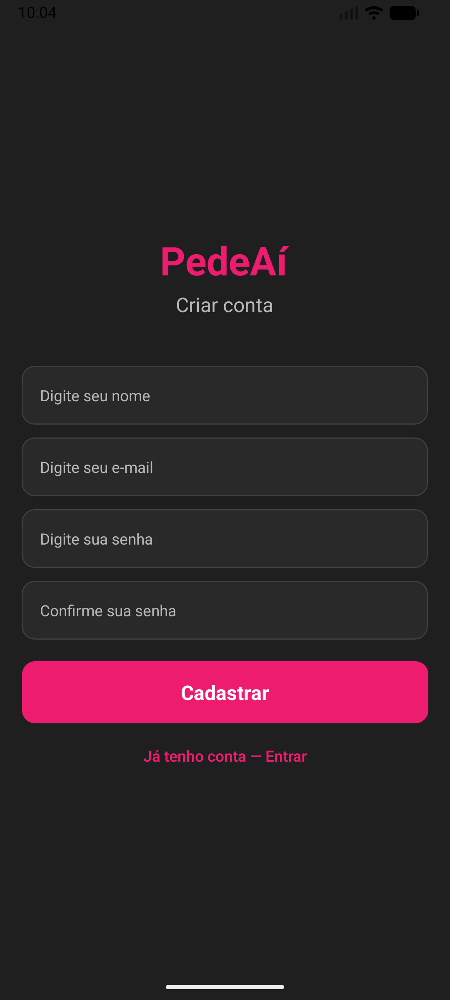
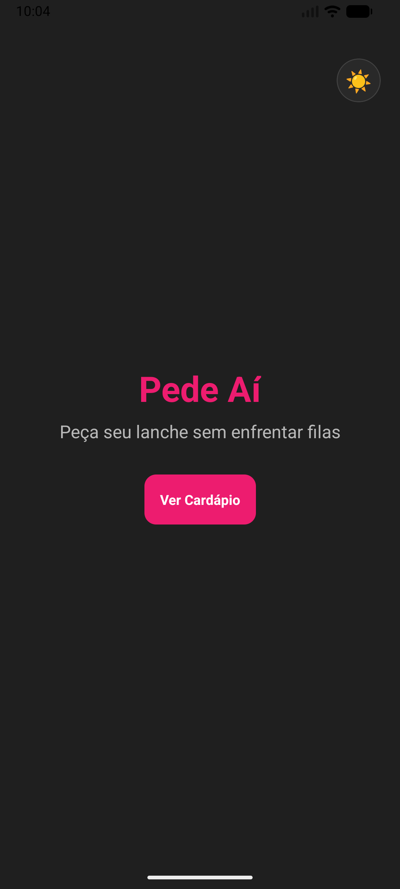
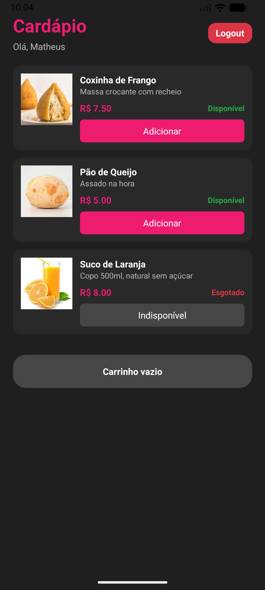
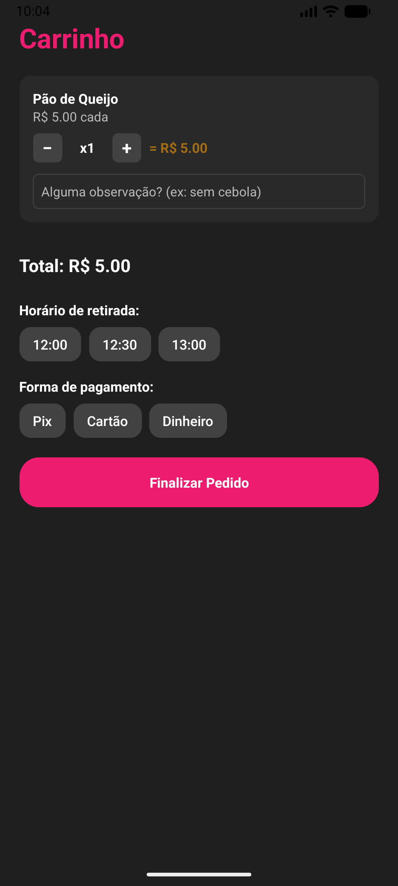
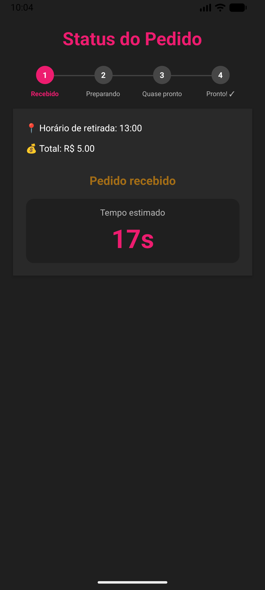

# 🍽️ PedeAí

> Aplicativo mobile para pedidos antecipados na cantina da FIAP — sem fila, sem espera.

---

## 📌 Sobre o Projeto

O **PedeAí** é um aplicativo mobile desenvolvido com **React Native + Expo** que permite que alunos façam pedidos na cantina com antecedência, escolham o horário de retirada e acompanhem o status em tempo real.

🎯 **Objetivo:** reduzir filas e melhorar a experiência no intervalo.

---

## 🔄 Evolução do CP1 → CP2
### CP1:
* Navegação entre telas
* Interface funcional
* Carrinho e fluxo de pedido

### CP2 (NOVO):
* Sistema completo de autenticação
* Persistência com AsyncStorage
* Context API para estado global
* Dark Mode (diferencial)

---

## 👨‍💻 Equipe

| Nome                                 | RM       |
| ------------------------------------ | -------- |
| Djalma Moreira de Andrade Filho      | RM555530 |
| Felipe Paes de Barros Muller Carioba | RM558447 |
| Lucas Rodrigues de Queiroz           | RM556323 |
| Matheus Gushi Morioka                | RM556935 |
| Victor Hugo de Paula                 | RM554787 |

---

## ⚙️ Funcionalidades

### 🔐 Autenticação
* Cadastro com validação completa
* Login com verificação de credenciais
* Sessão persistida com AsyncStorage
* Logout funcional

### 🛒 Pedido
* Cardápio com imagens e disponibilidade
* Carrinho com controle de quantidade
* Observações personalizadas
* Escolha de horário
* Escolha de pagamento
* Finalização do pedido

### 📊 Acompanhamento
* Status em tempo real
* Barra de progresso visual
* Contagem regressiva até retirada

---

## 🚀 Como rodar

### Pré-requisitos
* Node.js (v18+ recomendado)
* Expo CLI
* Expo Go (celular) ou emulador
* SDK Expo ~54

```bash
# Clone o projeto
git clone https://github.com/dipaula-victo/fiap-mdi-cp2-pedeai.git

# Entre na pasta
cd pede-ai

# Instale dependências
npm install

# Rode o projeto
npx expo start
```

---

## 📲 Execução

* Use o app **Expo Go** no celular
* Ou pressione `w` para abrir no navegador

---

## 📱 Capturas de Tela

| Login | Cadastro |
| --- | --- |
|  |  |

| Tela Inicial | Cardápio |
| --- | --- |
|  |  |

| Carrinho | Status do Pedido |
| --- | --- |
|  |  |


---

## 🎥 Demonstração

(https://www.youtube.com/shorts/afwWdeU9ymQ)


---

## 🔄 Fluxo do App

```text
Autenticação → Início → Cardápio → Carrinho → Status do Pedido
                                                     ↓
                                             Retirada no balcão
                                                     ↓
                                                Novo pedido
```


## 🗂️ Estrutura do Projeto

```bash

## 🗂️ Estrutura do Projeto

```bash
FIAP-MDI-CP2-PEDEAI/
├── pede-ai/
│   ├── .expo/
│   ├── app/
│   │   ├── (auth)/
│   │   │   ├── cadastro.js      
│   │   │   └── login.js        
│   │   │
│   │   ├── (tabs)/
│   │   │   ├── cart.js          
│   │   │   ├── index.js         
│   │   │   ├── menu.js          
│   │   │   └── status.js        
│   │   │
│   │   └── _layout.js        
│   │
│   ├── assets/               
│   │
│   ├── components/
│   │   ├── BadgeStatus.js       
│   │   ├── BarraProgressoPedido.js 
│   │   ├── BotaoCustomizado.js  
│   │   └── CardProduto.js       
│   │
│   ├── constants/
│   │   └── theme.js            
│   │
│   ├── context/
│   │   ├── AuthContext.js      
│   │   ├── CarrinhoContext.js   
│   │   └── ThemeContext.js      
│   │
│   ├── node_modules/
│   ├── app.json
│   ├── package-lock.json
│   ├── package.json
│
├── LICENSE
└── README.md

```

## 🌐 Contexts

### AuthContext

* Usuário logado
* Login
* Logout
* Persistência da sessão
* CarrinhoContext
* Estado do carrinho
* Adição/remoção de itens
* Finalização de pedidos
* ThemeContext
* Dark mode
* Alternância de tema

---

### 🔐 Autenticação

* Dados armazenados no AsyncStorage
* Validação no login
* Sessão persistida
* Redirecionamento automático

---

### 💾 AsyncStorage

Utilizado para salvar:
* Usuário → "usuario"
* Sessão → "usuarioLogado"
* Carrinho → "carrinho"
* Pedidos → "pedidos"

---

### 🔒 Navegação protegida

Implementada em _layout.js:
*Usuário não logado → redirecionado para login
*Usuário logado → acesso liberado ao app

---

## ⭐ Diferencial Implementado
### 🌙 Dark Mode
### ✔️ O que é:
Sistema de alternância entre modo claro e escuro

### 🎯 Por que escolhemos:
Melhora a experiência do usuário
Aumenta acessibilidade
Torna o app mais moderno
### ⚙️ Como foi feito:
* ThemeContext
* Uso de useTheme()
* Estilos dinâmicos (createStyles)
* Botão de toggle na tela inicial

---

## 🔮 Próximos Passos

Se tivéssemos mais tempo:
* Backend real (API)
* Histórico de pedidos
* Notificações push
* Pagamento integrado
* Painel administrativo

---

## 🛠️ Tecnologias

| Tecnologia   | Uso           |
| ------------ | ------------- |
| React Native | Interface     |
| Expo         | Plataforma    |
| Expo Router  | Navegação     |
| AsyncStorage | Persistência  |
| Context API  | Estado global |

---

📄 Licença

MIT © FIAP
